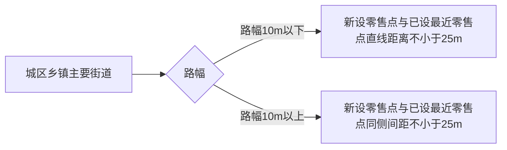

# 待办事项：

## 证件管理

###  资料变更

  1. 联系电话变更
        - [ ] 13774554612=>350182107660 福州市长乐区潭头哲瑜电子店 2020年1月13日
  2. 地址相同：
        - [ ] 福建省福州市长乐区漳港街道新厝村工地 350182107392、350182107409 2020年1月13日
        - [ ] 福建省福州市长乐区潭头镇潭头村上港 350182101201、350182105341 2020年1月13日
  3. 地址需要修改
        - [ ] 350182107392 福建省福州市长乐区漳港街道新厝村友坤路 45 号 2020年1月13日

###  不予延续

- [ ] 黄秀美 350182104487 长乐市漳港镇秀美食杂店 2020年1月13日

###  新办 

- [ ] 漳港 杨雪云 13799958495 福州市长乐区漳港街道门楼村建设路118-1号 装修中 2020年1月13日
- [x] 漳港 杨晴 17759873726 漳港商行街130号 已走流程 2020年1月15日

###  延续

- [x] 杨建容	15959194269	350182107258	福州市长乐区漳港建容食杂店	福建省福州市长乐区漳港街道新厝老人馆对面 2020年1月13日

###  歇业注销

- [ ] 陈龙钦 	15050004446	350182107261	福州市长乐区漳港涵涵便利店	福建省福州市长乐区漳港街道新厝老人馆对面 2020年1月15日
------

# 合理布局：

<table>
	<caption ><h2>福州市长乐区烟草制品零售点合理布局规划</h2></caption>
    <tr>
        <th colspan="4">应具备的经营条件</th>
    </tr>
    <tr>
        <td colspan="2">独立销售展柜</td>
        <td colspan="2">陈列烟草制品的独立销售展柜，以及可存放烟草制品的独立货柜</td>
    </tr>
    <tr>
        <td colspan="2">营业区域不少于10m2</td>
        <td colspan="2">应具备必要的营业区域，其中烟草制品和食杂类营业区域面积应不少于10m2</td>
    </tr>
    <tr>
        <th>限制性</th>
	    <th>分类</th>
	    <th>布局条件</th>
	    <th>新增条件</th>
    </tr>
    <tr>
        <td rowspan="2">受布局间距限制</td>
        <td rowspan="2">城区、乡镇主要街道</td>
        <td>路幅宽度10m以下的街道</td>
        <td>新设零售点与已设最近零售点直线距离不少于25m</td>
    </tr>
    <tr>
        <td>路幅宽度10m以上，或设有隔离栏、绿化带的街道</td>
        <td>新设零售点与已设最近零售点同侧间距不少于25m</td>
    </tr>
    <tr>
        <td rowspan="6">不受布局间距限制、但受数量限制</td>
        <td >行政村、自然村、工业园区</td>
        <td >300人以下设置1个零售点</td>
        <td >每增加250人可增设1个零售点</td>
    </tr>
    <tr>
        <td >长途汽车站、火车站、港口码头候车（船）室</td>
        <td >200m2以下的可设置1个零售点</td>
        <td >每增加500m2可增设1个</td>
    </tr>
    <tr>
        <td >封闭式住宅小区</td>
        <td colspan="2">每200户可设置1个零售点</td>
    </tr>
    <tr>
        <td >综合型农贸、商贸、副食品交易市场</td>
        <td  colspan="2">每50个摊位可设置1个零售点</td>
    </tr>
    <tr>
        <td >大型商场</td>
        <td  colspan="2">同一楼层内每50个摊位可设置1个零售点</td>
    </tr>
    <tr>
        <td >施工工地</td>
        <td >50人以上100人以下的，可设置1个零售点</td>
        <td >每增加250人可增设1个</td>
    </tr>
    <tr>
        <td rowspan="6">不受限制</td>
        <td colspan="3">机场候机厅内</td>
    </tr>
    <tr>
        <td >全封闭式或半封闭式的特殊区域内设置的对内经营场所</td>
        <td colspan="2">如高速公路服务区、部队营区、监狱、看守所、拘留所等</td>
    </tr>
    <tr>
        <td >便利店、超市、商场等零售业态经营户</td>
        <td  colspan="2">营业面积200m2以上</td>
    </tr>
    <tr>
        <td >重新申领零售许可证</td>
        <td colspan="2">因经营主体发生变化而经营地址不变，重新申领零售许可证的</td>
    </tr>
    <tr>
        <td >申请办理零售许可证变更</td>
        <td colspan="2">因道路规划、城市建设等客观原因造成经营地址变化，在六个月内凭相关证明材料申请办理零售许可证变更的</td>
    </tr>
    <tr>
        <td colspan="3">法律、法规、规章规定的其他情形</td>
    </tr>
    <tr>
        <td rowspan="7">完全限制</td>
        <td >中、小学校</td>
        <td  colspan="2">中、小学校内，以及中、小学校进出通道口门线任意点直线距离50m范围内</td>
    </tr>
    <tr>
        <td >住宅</td>
        <td  colspan="2">住宅或非住宅用房二楼及二楼以上，且经营场所与住所不相独立的</td>
    </tr>
    <tr>
        <td >安全隐患</td>
        <td  colspan="2">经营场所存在安全隐患，且不具备安全措施保障，不适宜经营卷烟的</td>
    </tr>
    <tr>
        <td >有毒、有害</td>
        <td  colspan="2">生产、销售、存储、运输有毒有害以及容易造成卷烟污染的物品的</td>
    </tr>
    <tr>
        <td >拆迁区域</td>
        <td  colspan="2">已被政府纳入拆迁规划，且已经公布或公告的区域</td>
    </tr>
    <tr>
        <td >与食杂、饮食无关业务的经营场所</td>
        <td  colspan="2">包括但不限于下列专门经营建筑装潢、五金交电、药品及医疗器械、文化用品、邮电通讯、报刊书籍、仪器仪表、金银珠宝、修理修配、游艺网吧、彩票销售、洗涤、房屋中介、寄卖行、典当行或美容美发足浴等与食杂、饮食无关业务的经营场所</td>
    </tr>
    <tr>
        <td colspan="3">法律、法规、规章规定的其他情形</td>
    </tr>
</table>

<table>
	<caption ><h2>福州市长乐区城区、乡镇主要街道界定范围</h2></caption>
    <tr>
        <th >序号</th>
        <th >乡镇</th>
        <th >乡镇街道范围</th>
    </tr>
    <tr>
        <td >1</td>
        <td >吴航街道</td>
        <td >吴航路、南山路、郑和东路、郑和中路、航华路、三峰街、爱心路、解放路、东鹤路、建设路、胜利路、奎桥路、西洋中路、培青路、鳌山路、杨井路、和平街、民主街、河下街、西关街</td>
    </tr>
        <td >2</td>
        <td >航城街道</td>
        <td >吴航路、南山路、龙景路、郑和西路、三峰西路、会堂路、广场路、爱心路、西洋南路、西洋北路、朝阳路、江莲路、大同路、航筹路、、榕航东路、榕航西路</td>
    </tr>
    <tr>
        <td >3</td>
        <td >首占镇</td>
        <td >凯歌路、和谐路、海峡路、会堂路、西洋路、永荣支路、振铎路、前街路、新明路、后首线</td>
    </tr>
        <tr>
        <td >4</td>
        <td >营前街道</td>
        <td >新兴路、营中路、东街路、新街路、滨江路、江乾路、营滨路、港南路、峡港路、峡漳路</td>
    </tr>
    <tr>
        <td >5</td>
        <td >玉田镇</td>
        <td >新街路、万侯街、桃源村新兴东路</td>
    </tr>
    <tr>
        <td >6</td>
        <td >罗联乡	</td>
        <td >吴村</td>
    </tr>
    <tr>
        <td >7</td>
        <td >猴屿乡	</td>
        <td >无</td>
    </tr>
    <tr>
        <td >8</td>
        <td >金峰镇	</td>
        <td >胪峰大道（金港路口到塘下路口），建设路，振兴路，星光大道，金峰村、六林村，三星村</td>
    </tr>
    <tr>
        <td >9</td>
         <td >漳港街道</td>
         <td >漳港村、漳光村</td>
    </tr>
        <tr>
        <td >10</td>
         <td >湖南镇</td>
         <td >无</td>
    </tr>
        <tr>
        <td >11</td>
         <td >潭头镇</td>
         <td >潭头村（建设路）、菊潭村、朱熹街，201省道（霞江段）</td>
    </tr>
        <tr>
         <td >12</td>
          <td >文岭镇</td>
          <td >无</td>
    </tr>
        <tr>
         <td >13</td>
          <td >梅花镇</td>
          <td >梅城村、梅新村、梅东村、梅南村、梅北村、梅西村</td>
    </tr>
    <tr>
        <td >14</td>
         <td >鹤上镇</td>
         <td >主干道鹤梅线（鲤鱼山工业区至长乐区鹤上卫生院）</td>
    </tr>
    <tr>
        <td >15</td>
         <td >古槐镇</td>
         <td >中街村</td>
    </tr>
    <tr>
        <td >16</td>
         <td >江田街道</td>
         <td >滨西一路、滨东一路、江滨大道、江田广场</td>
    </tr>
    <tr>
        <td >17</td>
         <td >文武砂镇</td>
         <td >义新街北</td>
    </tr>
    <tr>
        <td >18</td>
        <td >松下镇</td>
        <td >融鹤线（首祉村段）</td>
    </tr>
</table>
